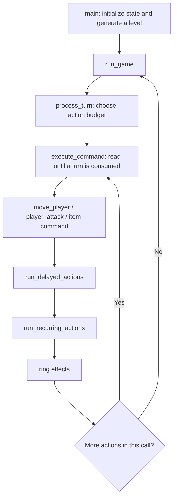

# Rogue (study fork)

Study fork of [MestreLion/roguepc](https://github.com/MestreLion/roguepc), a modern port of the original IBM PC Rogue source. Gameplay uses ncurses; SDL2 displays the optional opening picture. The historical C and DOS assembly are retained for study.

This fork prioritizes readable gameplay logic, source-backed explanations, and reproducible correctness fixes.

## Build and run

Requires a C17 compiler, GNU Make, pkg-config, ncursesw development files, and X11 development files. SDL2 development files are needed for `make sdl` or `make all`.

On Debian/Ubuntu:

```sh
sudo apt install build-essential pkg-config libncurses-dev libx11-dev libsdl2-dev
make -j
make -j sdl
./roguepc
```

`make` builds `src/rogue`; `make sdl` builds `src/rogue-sdl` and the standalone `src/splash/splash` viewer. `make all` builds both variants. The same targets work with `make -C src`.

Use a UTF-8 locale and a terminal of at least 80 columns by 25 rows. To play in the current terminal:

```sh
cd src
./rogue
```

`./roguepc` opens xterm or GNOME Terminal when available, otherwise uses the current terminal. `./roguepc --no-splash` selects the terminal-only executable. Pass game arguments after `--`, for example `./roguepc --no-splash -- -s` to view scores. The GNOME launcher expects the `RoguePC` terminal profile; direct execution does not need it.

Launchers run repository binaries from `src/`, where their picture, options, and score files live. A custom executable selected with `--rogue CMD` keeps the caller's working directory. `ROGUE_PIC` overrides the SDL picture path; the default is `./rogue.pic`.

Enter a name or press Enter at startup. Use `h j k l` to move left/down/up/right and `y u b n` diagonally. `i` shows inventory, `?`/F1 lists commands, `/`/F2 lists symbols, and `Q` quits after confirmation.

For a build without X11, use `make ROGUE_NO_X11=1`. `ROGUE_RELEASE=1` enables optimization; `ROGUE_CHARSET=1` selects ASCII with ncurses. Run `make clean` before changing compiler or build options.

## Configuration and limitations

An optional `rogue.opt` in the game's working directory accepts `key=value` lines and comments beginning with `#`:

```ini
name=Rodney
fruit=Slime Mold
menu=on
scorefile=rogue.scr
```

Names and fruit are limited to 23 bytes, score/save filenames to 14 bytes, and keyboard macros to 40 bytes. Longer values are truncated. Option names, `menu`, and `screen` are case-insensitive; `screen=bw` requests monochrome output.

Saving (`S`) and restoring (`-r` or a save filename) are explicitly disabled in this port. The original implementation depends on DOS memory layouts and needs replacement. Scores work, but their native C-struct file format is platform-dependent. The fake DOS screen (`!`/F10) has known scrolling/input limitations; type `rogue` to return.

## Study and checks

[original_code_analysis](./original_code_analysis) contains a copy of [Decoded: Rogue](https://www.maizure.org/projects/decoded-rogue), including line-by-line explanations. Commit `dd9179d` is the original source import; later commits show the porting changes.

The maintained C port uses descriptive symbols and module names: [game_state.c](src/game_state.c) holds globals, [level_generation.c](src/level_generation.c) builds levels, [platform.c](src/platform.c) handles platform services, and [screen.c](src/screen.c) implements terminal rendering. The original assembly and archived analysis retain their historical names; the assembly is reference material and is not linked into the Linux game.

### Guided reading map

Follow one player action through these functions:



1. **Startup — [main.c](src/main.c), [init.c](src/init.c).** `main()` allocates state, reads options, seeds randomness, initializes the player and item appearances, generates a level, and registers timed effects.
2. **A dungeon — [level_generation.c](src/level_generation.c), [rooms.c](src/rooms.c), [passages.c](src/passages.c).** `generate_level()` replaces the previous level, builds rooms and connections, and places items, stairs, traps and the player. [maze.c](src/maze.c) builds mazes.
3. **A command — [command.c](src/command.c).** `read_command_prefix()` handles counts, repetition and running; `execute_command()` selects the action. `turn_consumed = FALSE` requests another command without advancing effects, as inventory/help do. Incapacitation skips input but advances effects.
4. **Movement/combat — [move.c](src/move.c), [fight.c](src/fight.c), [chase.c](src/chase.c).** Follow `move_player()` through movement checks, traps and pickups. A monster collision reaches `player_attack()` → `resolve_attack_damage()`. Monster movement reaches `move_chasing_monster()` → `monster_attack()`.
5. **Effects — [turn_scheduler.c](src/turn_scheduler.c), [turn_effects.c](src/turn_effects.c).** Delayed callbacks run, then recurring callbacks, then rings. Timers count actions, not elapsed seconds; callbacks run synchronously. Commands can also invoke effects directly: rest regenerates health, and armor changes call `advance_turn()` for an extra recurring-effect pass.

Keep these data relationships in view while reading:

- **`Entity` — [rogue.h](src/rogue.h):** a union of actor and item views with shared list links. Context determines the valid view; `actor_*` and `item_*` macros select fields.
- **Maps — [gameplay.c](src/gameplay.c):** `terrain_map` stores terrain/item symbols; `cell_flags` stores passage, maze and hidden-terrain properties, plus context-dependent passage numbers or trap types. Storage is column-major: `map_index(y, x) = x * (dungeon_bottom_row - 1) + y - 1`. `visible_entity_at()` overlays monsters; `update_player_view()` controls display.
- **Lists — [entity_pool.c](src/entity_pool.c), [inventory.c](src/inventory.c):** `level_monsters`, `level_items` and inventories link pooled entities. Attach/detach changes membership; release makes a slot reusable. Trace one item through pickup, equipment and dropping.
- **Globals — [game_state.c](src/game_state.c), [init.c](src/init.c):** world/player state, definition tables and buffers are shared. `player_position`, `player_stats` and `player_inventory` alias fields of `player`. Formatting helpers reuse buffers; later calls can overwrite returned text.

Useful worked examples are [test_turns.c](tests/test_turns.c) for action order, [test_potions.c](tests/test_potions.c) for an effect's lifetime, and [test_messages.c](tests/test_messages.c) for text passing through the real command dispatcher.

Comments distinguish source-proven behavior from unresolved historical intent. The BIOS timer hook uses vector `0x1C` (table byte offset `0x70`); the trap display flag has three states. Historical DOS checksum bounds and physical disk-protection behavior are not established by the native stubs.

`make test` runs configuration, score-file, turn-processing, message-text, and potion-duration regression tests with AddressSanitizer and UndefinedBehaviorSanitizer. It requires a compiler with those sanitizers, pkg-config, and ncursesw development files. Gameplay tests exercise the real dispatcher and mechanics with controlled input, randomness, and terminal/effect callbacks; they need no display. Tests use temporary files under `/tmp`.

Function declarations and definitions are checked with GCC/Clang prototype warnings; exported definitions include their declaring headers. For GCC's additional checks across translation units, build with `make clean` then `make -j all CC=gcc CPPFLAGS=-flto LDFLAGS="-flto -Werror=lto-type-mismatch"`. A direct Clang type audit also checked declarations that optimization can discard, including the disabled save code.

Historical `WIZARD`, `DEBUG` (distinct from `ROGUE_DEBUG`), `UNIX`, and `ROGUE_DOS_CURSES` branches are not supported build configurations. They retain compile failures: for example, wizard gold input passes a `short *` and an extra argument to `get_num(int *)`; `UNIX` macros collide with function declarations; and the DOS screen backend mixes native and DOS interfaces. These branches require separate porting work.

## Corrections in this fork

- **C interfaces:** `saved_screen` was declared as `char[]` but defined as a curses-cell array. Its storage is now private, and the disabled legacy save code accesses bytes through the existing `get_saved_screen()` interface. Shared screen declarations now reach the implementation; string and SDL functions include their declaring headers, private helpers are `static`, and builds warn about missing function prototypes. Saving remains disabled. SDL diagnostic wrappers now have format checking, which exposed and fixed a `%X`/`size_t` mismatch.
- **Confusion potions — inherited DOS bug:** an outer “not confused” guard made the inner timer-extension branch unreachable. Drinking another confusion potion consumed it without extending the active effect. The guard is removed, so the existing timer is extended. Tests cover initial application, repeated doses at minimum/maximum duration rolls, and a single eventual expiration.
- **Message text:** replaying a message or displaying a completed description could interpret `%` sequences a second time, corrupting output or causing undefined behavior. Completed messages, item descriptions, combat names, and descent text now pass through a literal `%s` format. Compiler format checks cover the message wrappers. Tests exercise `%%`, `%s`, `%n`, `%d`, trailing `%`, and empty-message clearing.
- **Turn processing — inherited DOS bug:** the ring loop reused the action counter (`ntimes` in the original import), resetting it to 2 and preventing the turn routine from returning. A separate hand index lets it return after one normal action or the existing two/three-action haste budget. Delayed callbacks, recurring callbacks, and ring effects still run after each action in the same order. The regression test fails on the old loop and covers both haste budgets, both ring slots, teleport rolls, incapacitation, and haste expiring during callbacks.
- **Options:** prevent buffer overruns; handle empty values; honor the full 40-byte macro limit and normalize case-insensitive settings.
- **Scores:** validate loaded records, handle creation/write failures, and avoid decrementing the insertion pointer before the score array. The file format remains native C structs.
- **Display:** show the disabled-save notice on the message line instead of overwriting dungeon cells. Saving remains disabled.
- **Launchers:** fix `--no-splash`, duplicate arguments, executable resolution, working directories, and fallback when SDL libraries are missing.
- **Builds:** remove parallel clean/build races, serialize shared splash compilation, track source/header dependencies, and provide root build targets.

The original import at `dd9179d` and the archived analysis remain available for studying historical behavior. These are intentional corrections to the historical source or upstream port.
